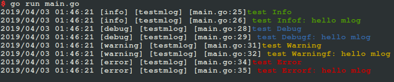

# mlog
Simple and efficient micro mlog library that supports features such as condition, color, and file split

# example
```
package main

import (
	"github.com/fatih/color"
	"github.com/jacky2478/mlog"
)

func initLog() {
	mlog.SetFlags(mlog.LstdFlags)
	mlog.SetDepth(4)
	mlog.SetHighlighting(false)
	mlog.SetLevel(mlog.LOG_LEVEL_ALL)

	// support log with color
	mlog.SetColorByLogType(mlog.LOG_INFO, color.GreenString)
	mlog.SetColorByLogType(mlog.LOG_ERROR, color.RedString)
	mlog.SetColorByLogType(mlog.LOG_WARNING, color.YellowString)
	mlog.SetColorByLogType(mlog.LOG_FATAL, color.RedString)
	mlog.SetColorByLogType(mlog.LOG_DEBUG, color.BlueString)
}

func main() {
	initLog()

	mlog.Info("test Info")
	mlog.Infof("test Infof: %s", "hello mlog")

	mlog.Debug("test Debug")
	mlog.Debugf("test Debugf: %s", "hello mlog")

	mlog.Warning("test Warning")
	mlog.Warningf("test Warningf: %s", "hello mlog")

	mlog.Error("test Error")
	mlog.Errorf("test Errorf: %s", "hello mlog")
}
```

# screenshot


